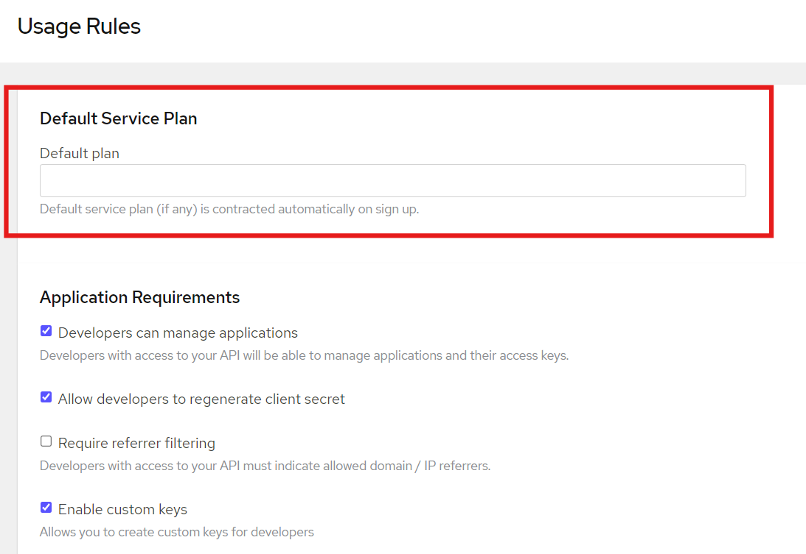
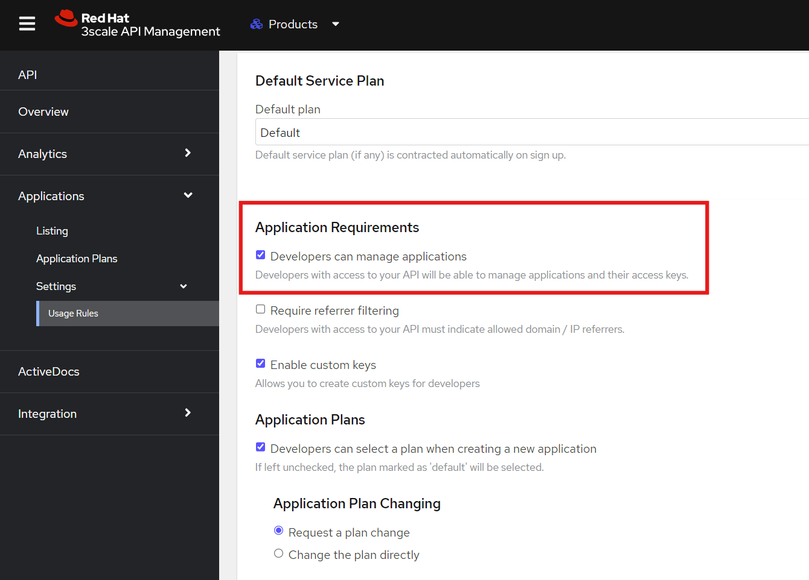
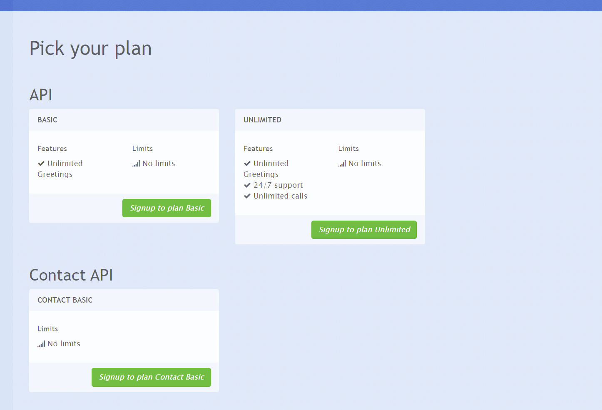
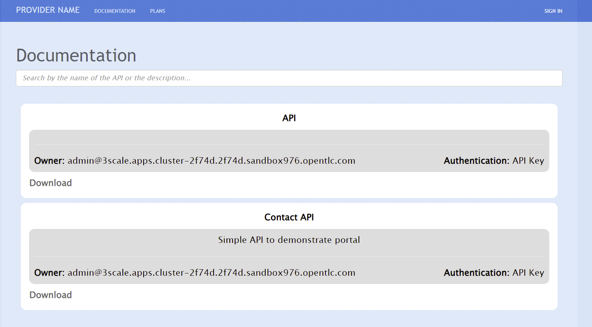
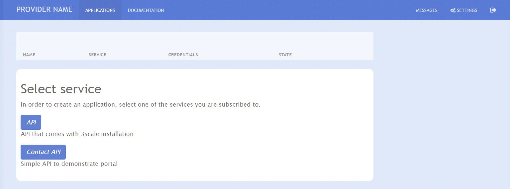
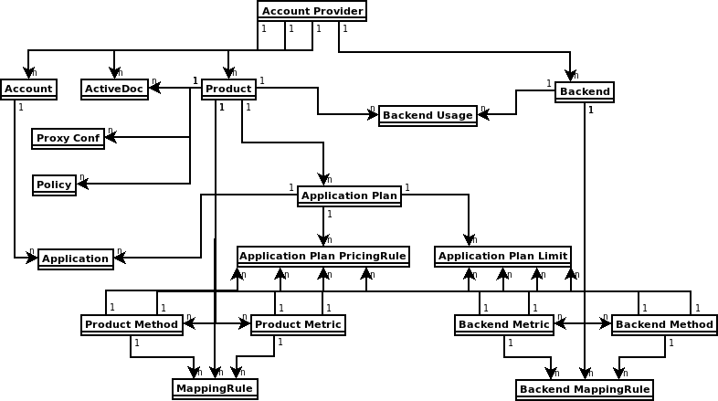
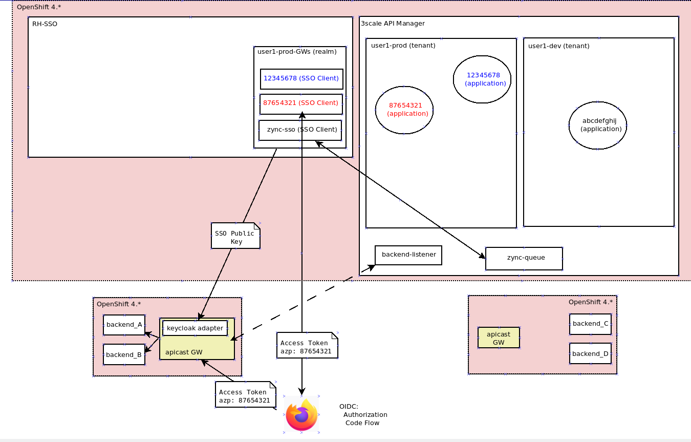

= Comprehensive 3scale Demo

This repository demonstrates how to use many of 3scale's features.

== Demo Last Tested with

- OCP 4.15
- oc client >= 4.15
- 3scale 2.14

== 3scale Installation

=== Parameters

[options="header"]
|=======================
| Parameter | Example Value                                      | Definition
| token     | sha256~vFanQbthlPKfsaldJT3bdLXIyEkd7ypO_XPygY1DNtQ | access token for a user with cluster-admin privileges
| server    | https://api.mycluster.domain.com:6443              | OpenShift cluster API URL
|=======================

===  How to run the playbook

----
ansible-playbook -e token=${token} -e server=${server} playbook.yml
----

== Manual steps

After the installation there are some steps that need to be done using 3scale's console.

=== Enable portal

Remove code on: https://${3scale-admin-portal}/site/dns

=== Update Provider Name

add a name for the provider here: https://${3scale-admin-portal}/p/admin/account/edit

=== Update Developer Portal Website

In the `dev-portal` folder you will find an automation to update the Developer Portal in a specific environment. Run the playbook in the same way you run the installation playbook.

=== Enabling Self-Service

It's possible to set how user can create applications through the portal. This configuration is done in the `Product` configuration in the Admin Portal.
To allow users to select how to create applications we have to: 

* Be sure the user is subscribed in the *Default* Service of that *Product*. You can either set the service for each user manually or let the *Default* service enable for every new sign-up. If the service is not enabled, the user won't be able to select the product. You have  to set it for every product.

* Enable users to manage applications for the *Product*.

==== Modifications

* Multiple plans

* Search docs

* Select API

== Using the 3scale CLI

=== Connect to tenants

export `UAT_TOKEN`, `PROD_TOKEN` and `DOMAIN` as environment variables, then run the following command.

----
3scale remote add -k uat https://${UAT_TOKEN}@uat-admin.apps.${DOMAIN}
3scale remote add -k prod https://${PROD_TOKEN}@prod-admin.apps.${DOMAIN}
----

=== Copy Database API Backend and Product

----
3scale backend copy -k -s prod -d uat database-backend
3scale product copy -k -s prod -d uat database-api
----

=== Copy Database API Application Plan

----
3scale application-plan export prod database-api basic -k > basic-plan.yml
3scale application-plan import uat -f basic-plan.yml database-api -k
----

=== Create an Application for the new Environment

Find an account:

----
3scale account find uat admin+test@example.com -a -k
----

Create the application with the account information:

----
3scale application create -k uat ${ACCOUNT_ID} ${SERVICE_ID} basic 'Test App' --application-id=${APP_ID} --application-key=${USER_KEY} --redirect-url=' ' --description='some description'
----

== How to present this demo?

this demo has many different features that can me demonstrated for different purpouse. I will document here some things you may need to know.

=== How to log in 3scale's console and SSO?

both are using self-generated credentials. 

. Look for the `system-seed` secret for the 3scale's credentials in the `demo-3scale` project
. Look for the `credential-example-keycloak` for SSO's credentials in the `demo-rhsso` project

=== How to use the Postman collection?

the Postman collection has 3 requests:

. Request SSO token
. GET Database API
. POST Database API

before starting using it, update the `cluster_domain` variable to reflect your OpenShift environment.

To be able to get an valid token from SSO, you need to update the *Request SSO Token* headers with the credentials generated for the application.
Go to SSO console and retrieve the `client_id` and `client_secret` from the latest created client.

=== How to present SMTP configuration?

SMTP configuration is required for 3scale's notification system to be able to send emails.
For this demo we can mock one using https://github.com/mailhog/MailHog[Mailhog]. To access it just hit the URL:

----
URL=$(oc get route mailhog -n demo-tools -o jsonpath='{.spec.host}')
echo https://$URL
----

=== How to present 3scale and Registry integration with Tekton?

This demo comes with a pipeline that downloads an Open API spec from Registry, publish it in 3scale and creates a ConfigMap for an application to consume.
You can find it in the `demo-cicd` project.
To demonstrate that feature you need an application like the one https://github.com/GuilhermeCamposo/demo_camel_k/tree/main[here].
You will need to configure that API on 3scale.

== Demo notes:

. 3scale ERD
+

. component architecture:
+

. env variables
+
-----
 $ export OIDC_PROVIDER_HOSTNAME=<hostname of RHBK>
 $ export OIDC_TOKEN_URL=https://$OIDC_PROVIDER_HOSTNAME/auth/realms/threescale-apps/protocol/openid-connect/token
 $ export API_SSO_CLIENT_ID=<3scale app id>
 $ export API_SSO_CLIENT_CRED=<3scale app secret>
 $ export API_GW_HOSTNAME=<hostname of 3scale APIcast gw>
 $ export API_GW_URL=https://$API_GW_HOSTNAME/backend
-----

. Retrieve tokens and parse for _access_token_ :
+
-----
$ TKN=$(curl -X POST "$OIDC_TOKEN_URL" \
            -H "Content-Type: application/x-www-form-urlencoded" \
            -d "grant_type=client_credentials" \
            -d "client_id=$API_SSO_CLIENT_ID" \
            -d "client_secret=$API_SSO_CLIENT_CRED" \
            -d "scope=openid" \
            | sed 's/.*access_token":"//g' | sed 's/".*//g')
-----

. Inspect token:
+
-----
$ jq -R 'split(".") | .[] | @base64d | fromjson' <<< $TKN | jq .
-----

. Populate _backend_ service with an _Attendee_ resource (in json representation):
+
-----
$ curl -v \
    -H "Authorization: Bearer $TKN" \
    -H "Content-Type: application/json" \
    -X POST $API_GW_URL \
    -d '{"name": "test", "email": "test@gmail.com" }'
-----

. Retrieve list of _Attendee_ resources:
+
-----
$ curl -v \
    -H "Authorization: Bearer $TKN" \
    -X GET $API_GW_URL
-----